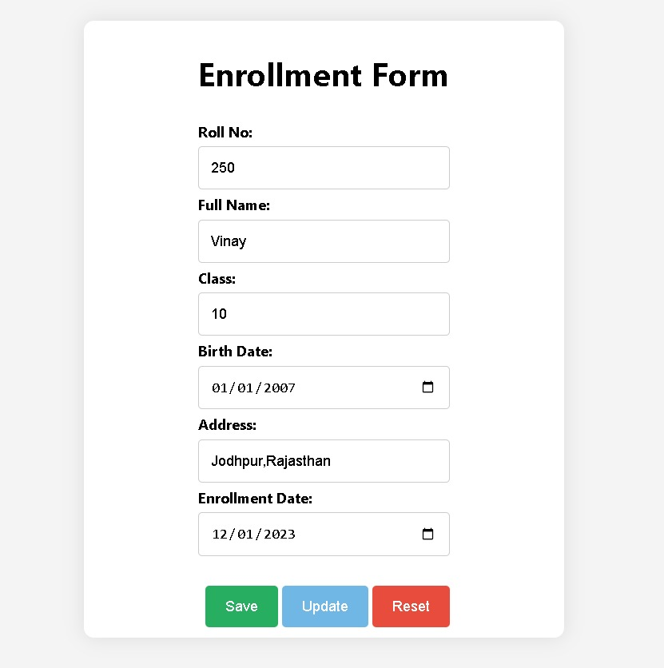
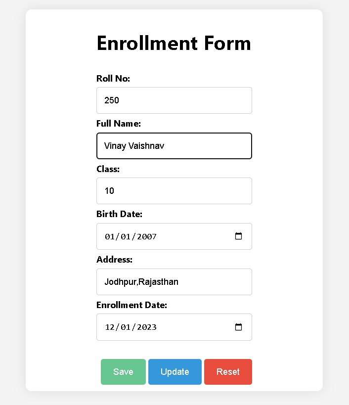

# Student Enrollment Form Using JsonPowerDB

## Description

This project is a web-based student enrollment form that allows users to input and manage student information. The form includes fields such as Roll No, Full Name, Class, Birth Date, Address, and Enrollment Date. The user can perform various actions, including saving new student data, updating existing records, and resetting the form.

## Features
- Data entry form with validation
- Update existing student records
- Retrieve student data from the database
- Integration with JSONPowerDB APIs

## Technologies Used
- HTML
- CSS
- JavaScript
- JSONPowerDB API

## Benefits of JSONPowerDB

### Schema-Free:
- JSONPowerDB supports schema-free data storage, allowing dynamic and flexible data structures without predefined schemas.
- Easy adaptation to changing data requirements.
  
### Serverless Support:
- JSONPowerDB operates in a serverless mode, eliminating the need for dedicated server infrastructure.
- Cost-effective deployment and maintenance.
  
### ACID Transactions:
- Ensures data integrity with support for ACID transactions (Atomicity, Consistency, Isolation, Durability).
- Reliable database operations even in the face of failures.

### Multi-Mode (NoSQL and DBMS):
- Acts as both a NoSQL database and a Database Management System (DBMS).
- Provides a flexible data model (NoSQL) and robust management capabilities (DBMS).

## Getting Started
1. Clone this repository.
2. Open index.html in a web browser.

## Usage
- Fill in the student enrollment form and click "Save" to store data.
- Click "Update" to modify existing records.
- Click "Reset" to clear the form.

## API Integration
The project uses JSONPowerDB APIs for data storage and retrieval. Replace the API endpoints and tokens in the scripts with your own.

## Examples of Use

- You will have to enter all the details to Enroll as a student.
  
  
- If you want to update you profile, just type your roll number and the form will be filled with your details then you can update them and just click on update.
  
  
- In case you want to remove the details you can click on reset and It will remove all details filled in the form.
